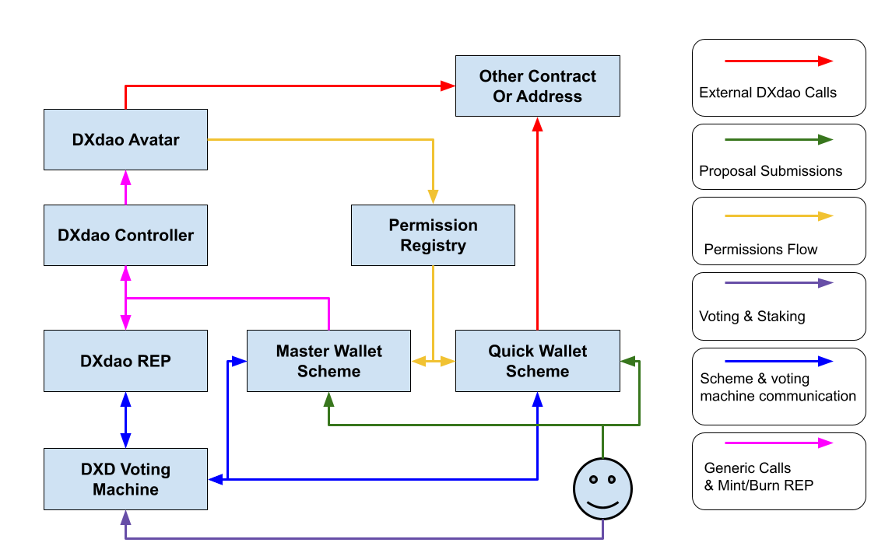

# DXdao-contracts

Repository with all the smart contracts for DXdao 1.x Governance.

## Configuration

Set your `.env` file following the `.env.example` file:
```
// Required
KEY_MNEMONIC="Seed Pharse Here"
KEY_INFURA_API_KEY="xxxx"

// Required to verify smart contracts
KEY_ETHERSCAN="xxx"

// Required for get reputation script
REP_FROM_BLOCK=7850172
REP_TO_BLOCK=12212988
```

## Commands

### Install

`yarn`

### Test

`yarn test`

### Gas Report

It will run the tests and report the gas cost of each function executed in every smart contract in the tests.

`ENABLE_GAS_REPORTER=true yarn test`

### Reputation Mapping

This script will get the DXdao Rep from mainnet DXdao rep token and REP mapping smart contract.

`yarn hardhat run --network mainnet scripts/getReputation.js`

### Coverage

`yarn hardhat coverage`

### DXvote contracts Deployment

`yarn hardhat run --network rinkeby scripts/deploy-dxvote.js
`

## Contracts

All the contracts are organized in different folders:

### Daostack

The smart contracts used for the DXdao avatar, reputation, native token and controller taken from daostack release version that was used at the moment of DXdao contracts deployment. https://github.com/daostack/arc/releases/tag/0.0.1-rc.19.

### DXdao
These are the smart contracts of the DXdao deployed in mainnet, taken from https://github.com/gnosis/dx-daostack. It also has the DXD guild and DXD voting machine that will be used in DXdao gov 1.x.

### Schemes
The smart contracts of the schemes used in DXdao gov 1.x, which are all WalletSchemes that use a PermissionRegistry to execute only previously allowed calls.



### ERC20Guild
The smart contracts to add a very basic, efficient and flexible governance layer over an ERC20 token.

The guild **executes previously authorized functions** to smart contracts after a proposal to execute that function reaches the **minimum amount of votes** using **locked tokens as voting power** after a **period of time**.

- The guild can execute only allowed functions, this means that if you want to call function X to smart contract P you will need to first submit a proposal to add the function X to smart contract P to be added to the allowed functions.

- The votes of the guild are based on the ERC20 token balance **locked by the voter**, that means that the tokens need to be locked for a minimum period of time in order to be used as voting power.

- The voter only votes on a proposal with the voting power that had the moment in the proposal was created.

- A minimum amount of voting power can be required to create a proposal.

- A proposal has only "positive" votes and the votes can be changed during the proposal voting period, this means that if the voter is against the proposal it does not need to vote.

- The voter can vote on multiple proposals at the same time using different amount of voting power for each of them.

- The voter can sign a vote that can be executed by other account on his behalf.

- When a proposal is created it enters the voting period. Once the voting period passes if the proposal dont have enough votes to execute, it will be rejected. If it has enough votes to execute and executes successfully during a the execution period of time, it will be finished successfully. If during that execution period of time the approved proposal cant be executed it will be set as failed and wont be able to be executed again.

- The guild can be configured to automatically pay the voting costs back to the voter, for this the vote gas a max gas price to be use for vote refund needs to be set.

- Each proposal has a description and a content hash that can be used to refer off-chain information.

### DXDGuild

The DXDGuild is an ERC20Guild with minimal modifications designed to be used to vote on the Genesis Protocol Voting Machine. The DXDGuild will have an amount of REP that will be used to vote in favor or against DXdao proposals.
The DXDGuild will create two proposals per DXdao proposal that wants to participate. One proposal will be to execute a positive vote on the Genesis Protocol and the other to execute a negative vote on the Genesis Protocol. The proposals are created at the same time and therefore they resolve at the same time.

### Utils
The smart contracts used to facilitate and automate the deployment of the DXdao.
